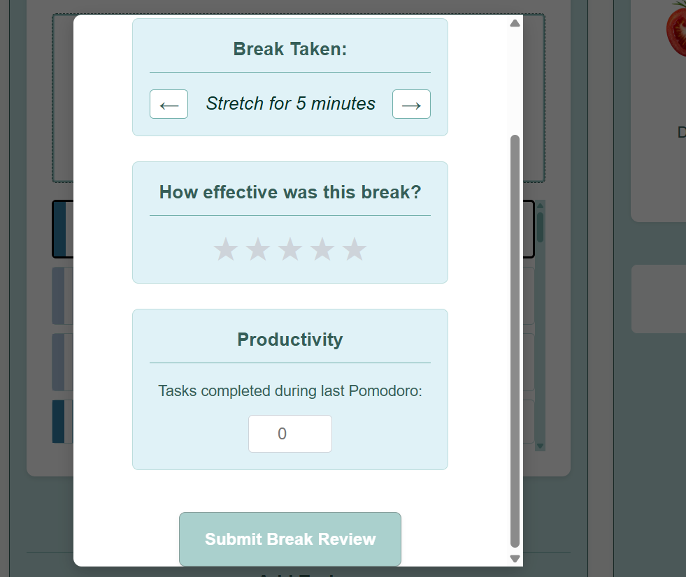
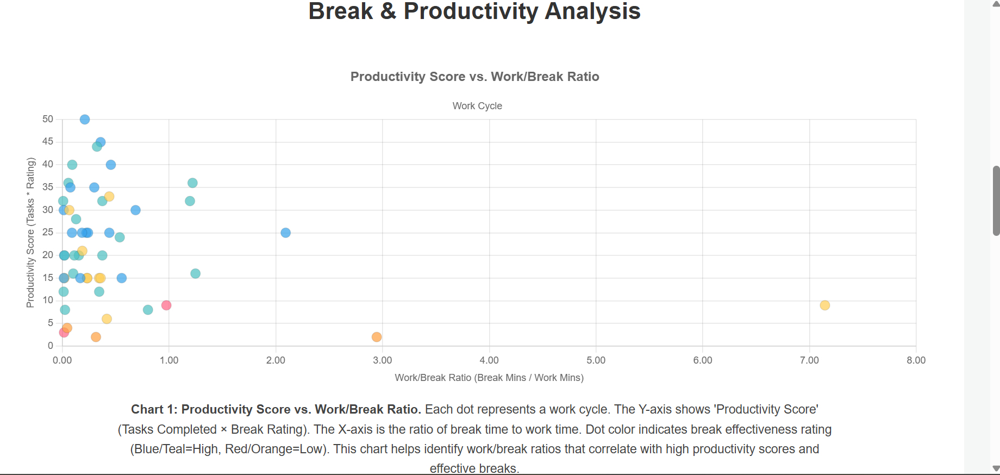
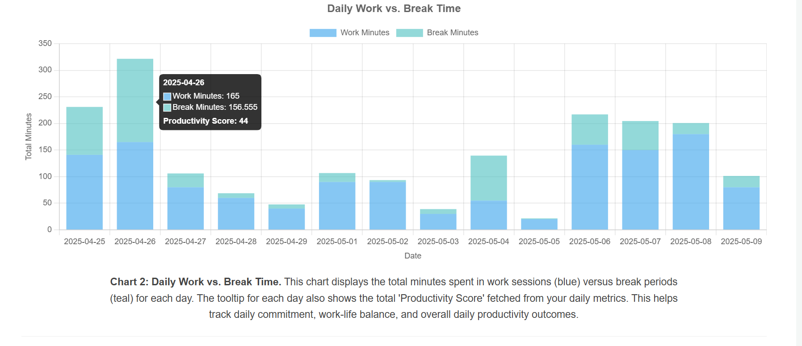
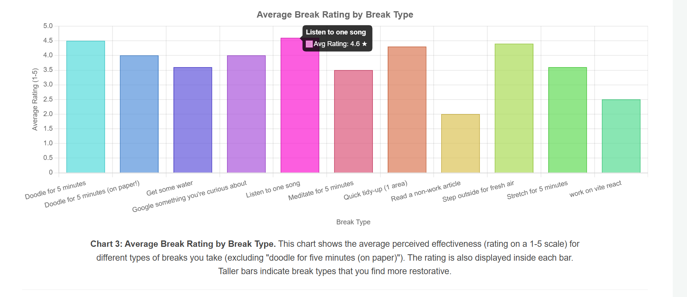
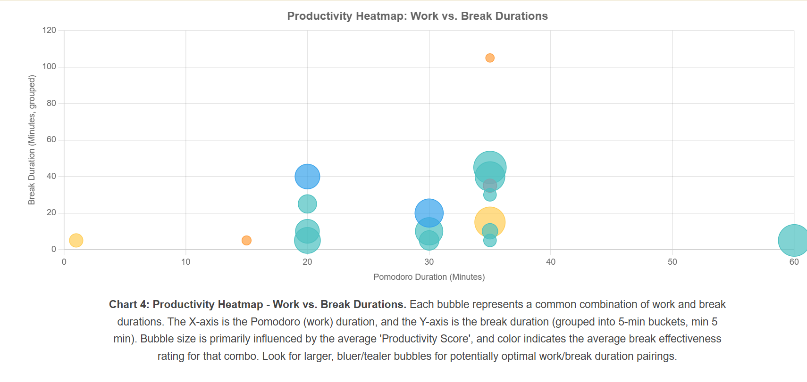

# Iteration 1: Initial Pomodoro Ratio Concept - Analysis

**Date:** 2025-05-10
**Feature Version:** Pomodoro Break Modal & Analysis Charts
**Git Tag/Commit:** `pomodoro-iteration-1-baseline` (or specific commit hash: `[2274fb16679b3494a412fe964f0b6da8dd208178]`)

## 1. Current Visuals & Functionality

Here's how the feature currently looks and is intended to work:

**BreakModal**

**BreakAnalysisCharts**

## 2. Analysis of Current Approach

After using this version for a week, I've identified the following issues with the current approach to finding the ideal work-to-break ratio:

* **Issue 1:** *I'm not measuring what I am attempting to measure.  I am seeing only correlations between time spent and tasks accomplished*
* **Issue 2:** *It is the break before the work period I need to measure*
* **Issue 3:** *I am not tracking the nature of tasks or my mindset*
* **Overall Conclusion:** *The current system is too simple and doesn't provide actionable insights into optimizing my personal work/break cycles effectively.*

## 3. Proposed Changes for Next Iteration (Iteration 2)

Based on the analysis above, I plan to make the following changes:

* **Change 1:** *I will add awareness levels to each break.  These levels will be N (relaxed focus or zoom: 100%), N-1 (hyperfocus or zoomed in), and N+1 (Expansive perspective or zoomed out)*
* **Change 2:** *I will change the break modal to have 3 small sections, Review Previous Work Period, Current Break and Break Rating, and Reorient for Next Work Period*
* **Change 3:** *I will add metrics for energy, frustration, and efficacy levels in the review previous work period and reorient for the next work period*
* **Hypothesis:** *These changes are expected to lead to a more adaptive and data-driven approach to identifying effective break strategies, moving beyond fixed ratios and including my subjective experience.*

## 4. Key Learnings from This Iteration

* *Learned that a one-size-fits-all approach to Pomodoro breaks isn't optimal for sustained productivity.*
* *Objective measures for analysis need to be balanced with qualitative feedback.*
* *Visualizations helped me see the limitations of my approach*