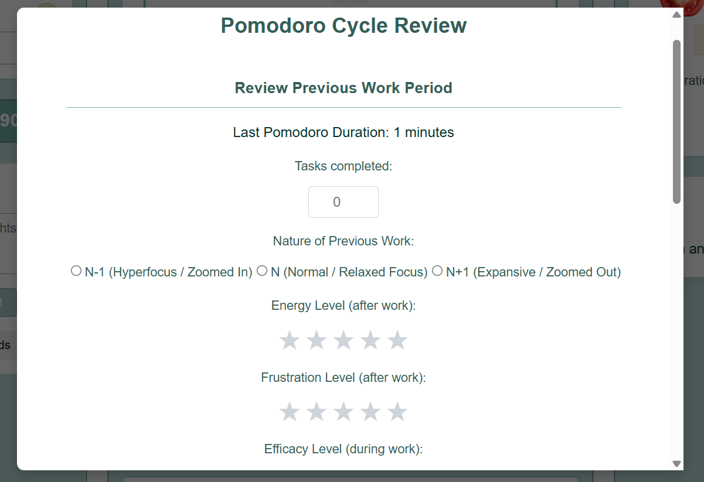
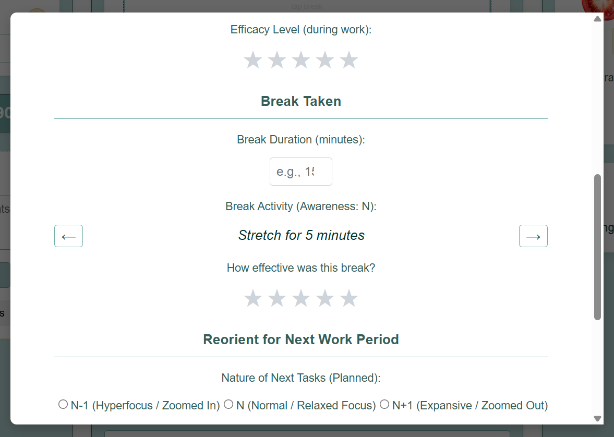
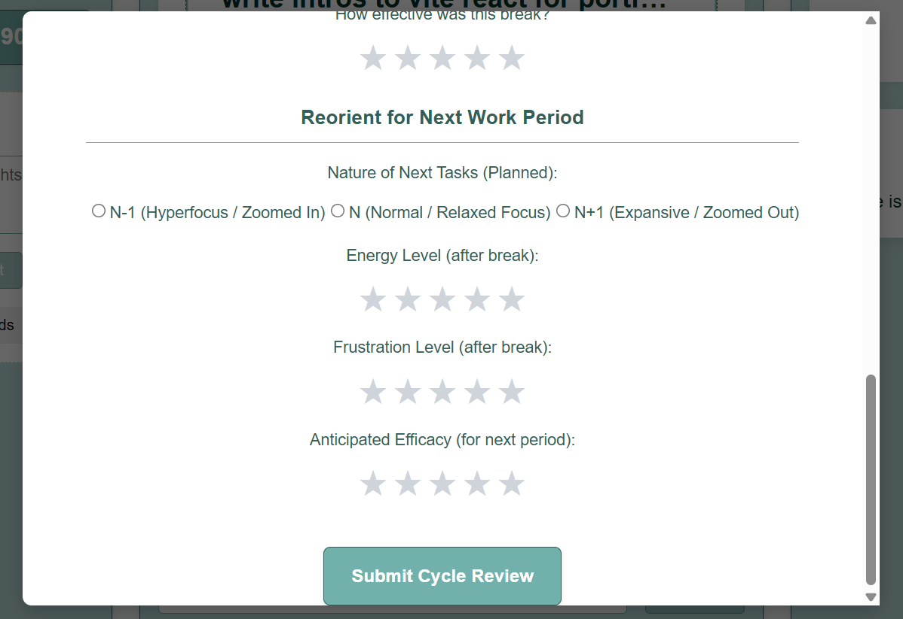
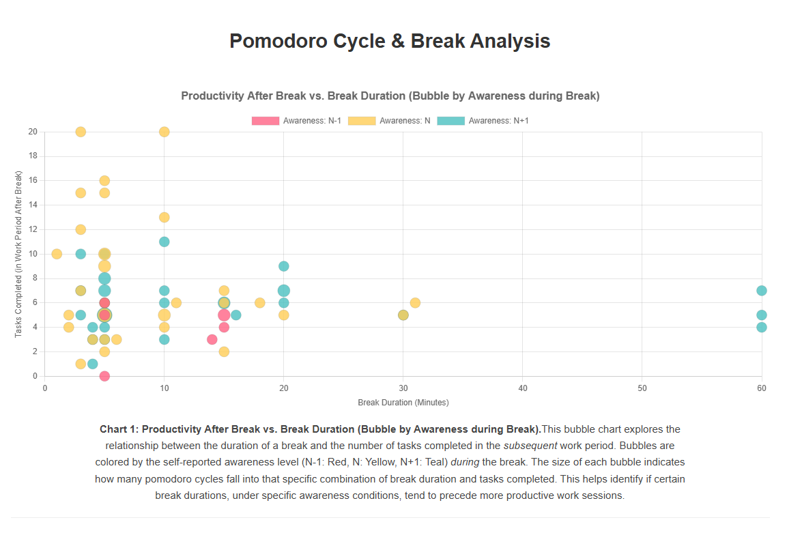
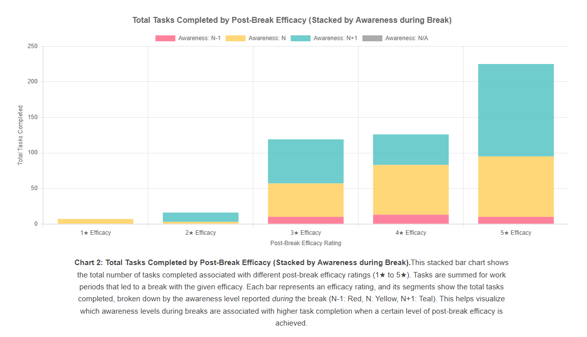
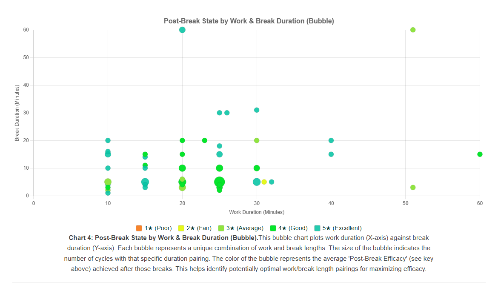
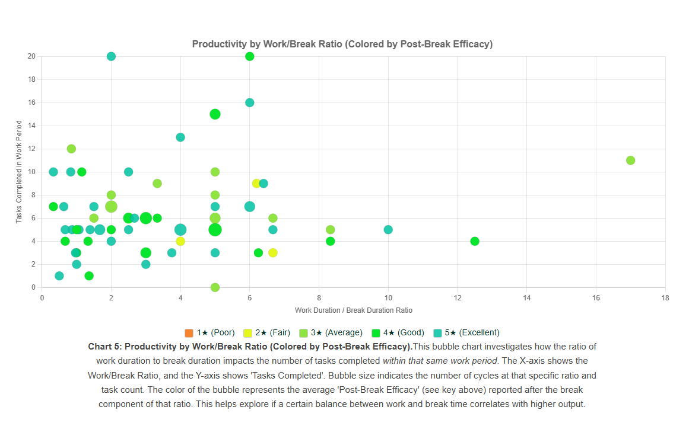

# Iteration 2: Enhanced Break Analysis with Awareness & Detailed Metrics

**Date:** [2025-05-17]
**Feature Version:** Pomodoro Break Modal & Analysis Charts v2
**Git Tag/Commit:** `pomodoro-iteration-2-awareness` (or specific commit hash: `[AWARENESS]`)

## 1. Current Visuals & Functionality (Iteration 2)

Here's how the feature currently looks and is intended to work after the Iteration 2 changes:

**BreakModal (Updated Structure - Conceptual)**
*(No screenshot yet, but describe the new 3-section layout)*
The Break Modal is now structured into three sections:
1.  **Review Previous Work Period:** (Likely includes inputs for energy, frustration, efficacy related to the *just-completed* work session).
2.  **Current Break and Break Rating:** (Includes break activity, awareness level during break (N-1, N, N+1), and break effectiveness rating).
3.  **Reorient for Next Work Period:** (Likely includes inputs for planned work nature, and anticipated energy, frustration, efficacy for the *upcoming* work session).

**BreakAnalysisModal (Updated - Iteration 2)**
*(You will insert these later)*
*   **Screenshot 1: Previous work period**
    
*   **Screenshot 2: Break Summary**
    
*   **Screenshot 3: Next Work Period**
    

**BreakAnalysisCharts (Updated - Iteration 2)**
*(You will insert these later)*
*   **Chart 1: Productivity After Break vs. Break Duration (Bubble by Awareness during Break)**
    
*   **Chart 2: Total Tasks Completed by Post-Break Efficacy (Stacked by Awareness during Break)**
    
*   **Chart 3: Average Post-Break Efficacy by Break Activity**
    
*   **Chart 4: Post-Break State by Work & Break Duration (Bubble)**
    
*   **Chart 5: Productivity by Work/Break Ratio (Colored by Post-Break Efficacy)**
    

## 2. Analysis of Current Approach (Iteration 2)

After implementing and reviewing the Iteration 2 changes, here's an analysis:

*   **Strength 1: Improved Data Granularity:** The introduction of "Awareness Levels" (N-1, N, N+1) during breaks (Chart 1, Chart 2) provides a new dimension to analyze break quality and its impact on subsequent productivity or perceived efficacy.
*   **Strength 2: Clearer Efficacy Insights:** Chart 3 (Avg Efficacy by Break Activity) effectively highlights which break types are subjectively rated as more refreshing, especially with the reverted dynamic coloring.
*   **Strength 3: Work/Break Ratio Exploration:** Chart 5 (Productivity by Work/Break Ratio) directly addresses the goal of understanding the balance between work and break times, with bubble color (Post-Break Efficacy) adding a qualitative layer.
*   **Issue 1 (Chart 4 & 5 Color Palette):** While the new color palette (Red, Orange, Blue, Purple, Green) for rating-based colors in Charts 4 & 5 is distinct, ensuring the user intuitively understands what each color represents without constantly referring to a key is important. The added textual key helps, but could it be more integrated or self-evident?
*   **Issue 2 (Chart 2 Y-Axis Interpretation):** Chart 2 now shows "Total Tasks Completed" on the Y-axis, associated with a specific post-break efficacy and awareness level from the *break that preceded that work period*. This is a powerful metric. The key is ensuring the user understands this linkage: high efficacy after a certain type of break leads to X tasks completed.
*   Issue 3 (measuring scope and longevity): I am interested in finding ideal intervals of time to work and rest based on awareness, but the goal is to use this to complete more OVER TIME.  I need to show productivity over time for each awareness level. By honing in on the activities Im doing, I will be able to use external measures to show correlation with real world results which is a more powerful and motivating concept. It also reduces uncertainty. N-1 could have an external measure of tickets completed and queue total (this would require further data collection).  N could have an external measure of the ratings of cleanliness using the family clean data. N+1 could have an external measure of writing and we could measure long term effectiveness in lines or pages written. I can have the hover over note the highest rated breaks and the average interval. I want to see the rate of production so I need more uniform tasks and to use set time ratios for a period of time.  I also could show epiphanies and despairs on the productivity over time to see how it interacts.  I think in the very least we will see I use the break feature less on days with higher despair ratings.
*   **Potential Next Step - Distraction Tracking:** The idea of a "distraction button" near the timer, mentioned as a future improvement, remains a strong candidate for adding context to work period quality. This would directly feed into understanding *why* focus might have been low or why a break was particularly needed.
*   **Overall Conclusion (Iteration 2):** This iteration significantly advances the ability to analyze break effectiveness. The charts now offer deeper insights by incorporating awareness levels and focusing on more direct relationships between break quality and work outcomes. The system is becoming more nuanced and data-driven. 

## 3. Proposed Changes for Next Iteration (Iteration 3)

Based on the analysis above, I plan to make the following changes:

*   **Change 1: Implement Distraction Tracking:** Add a "Distraction Logged" button during Pomodoro work sessions. Each press increments a counter for that session. This data point (`distractionCount`) will be saved with the `pomodoroCycleLog`.
*   **Change 2: Integrate Distraction Data into Charts:**
    *   **New Chart or Modify Existing:** Explore a chart showing `distractionCount` vs. `Perceived Focus During Pomodoro` (if collected) or vs. `Tasks Completed`.
    *   **Bubble Chart Enhancement:** In charts like Chart 4 or 5, `distractionCount` could influence bubble size or be a secondary color dimension/tooltip item to see if high-distraction sessions respond differently to work/break patterns.
*   **Change 3: Refine Subjective Metrics in Break Modal:** Review the "Review Previous Work Period" and "Reorient for Next Work Period" sections of the break modal. Ensure the metrics (energy, frustration, efficacy) are clearly defined and easy for the user to rate consistently. Consider if "Perceived Focus" for the *just-ended* work session should be explicitly captured.
*   **Change 4 (Optional - UI):** Explore if the color key for Charts 4 & 5 can be made more visually integrated, perhaps as a gradient legend if the charting library supports it, or ensure the current textual key is always clearly visible near the charts.
*   **Hypothesis (Iteration 3):** Adding distraction tracking will provide a crucial objective measure of work quality, allowing for a clearer understanding of how external factors influence focus and the subsequent need for and effectiveness of breaks. Refining subjective inputs will improve data quality.

## 4. Key Learnings from This Iteration (Iteration 2)

*   **Awareness Levels Add Value:** Segmenting break analysis by "Awareness Level" (N, N-1, N+1) has started to reveal patterns that a simple duration/activity analysis missed.
*   **Bubble Charts for Density:** Using bubble size to represent the count of data points in scatter-type plots (Charts 1, 4, 5) is effective for visualizing data density and avoiding misinterpretation from overlapping points.
*   **Data Linkage is Key:** Carefully considering which data points are linked (e.g., break quality from `previousLog` impacting tasks in `currentLog` for Chart 1, or tasks in `currentLog` related to the break in `currentLog` for Chart 5) is crucial for meaningful analysis.
*   **Iterative Color Palette Refinement:** Choosing effective and distinct color palettes for different data dimensions (awareness vs. ratings) is an ongoing process.
*   **The Y-axis of Chart 2 (Total Tasks Completed):** Shifting this from "cycle count" to "total tasks completed" provides a more direct measure of output related to post-break efficacy and awareness state.