# Gearshift App Context Document

## General

### 1. Overview and Premise

This document provides a comprehensive overview of the Gearshift WebApp. This web application serves as a "gearshift" to the user's experience, perspective, and focus. It is intended to help the user navigate long term goals and projects and is organized into a series of interconnected dashboards or "views" designed to help the user stay oriented, increase motivation and stamina, and optimize their experience. The web app has built in data collection modals so the user can track progress and gain insight into how their brain works. It is a sub-project within the "Gear Axis" of the broader Pareto Project (5-year plan). The primary goal of this application is to enable the user to identify the most productive 20% of efforts within chosen life axes, fostering unexpected insights and a sense of completion. It aims to provide a structured framework for intentional living, ensuring that 100% of efforts become effective by focusing on the 20% most impactful actions within five key areas.

### 2. Core Features and Functionality

The Gearshift WebApp is built around several core concepts designed to help the user optimize focus, manage energy, and align actions with long-term values. The functionality emerges from the interplay of these foundational elements:

**The Five Axes of Focus: A Framework for Holistic Progress**

The web app divides goals into 5 Axes, which provide a comprehensive framework for the user to categorize and balance their efforts across all significant areas of life. This structure ensures that goal setting and activity tracking are not siloed but contribute to a holistic vision of personal development. Developing different areas concurrently allows the user to make connections and accelerate growth. By assigning tasks, routines, and reflections to specific axes, the user can visually and analytically assess where their energy is flowing and identify areas that may need more or less attention, aligning with the Pareto principle of focused effort. These axes could be customized for individual users if the web app expanded, but the specific axes chosen by the creator are as follows:

* Misdirect: strategic distractions
* Physical: mastery of movement
* Financial: survival and funding endeavors
* Mental: mind control and values alignment
* Environment: shaping surroundings

**Views: Training Perspective and Navigating Different Levels of Focus**

The application utilizes a system of interconnected views that allow the user to adjust perspective, seamlessly "zooming" in and out of their life's activities and goals.

* **Life View:** A timeline of the user’s life and overall stats
* **Pareto View:** An outline of the user’s current 5 year project and stretch goals for each project.
* **Yearly View:** An outline of the user’s current yearly goals and progress
* **Month View:** Time Based theming that doesn’t necessarily relate to any Axis
* **Weekly View:** designed for higher-level planning and thematic organization, aligning days with specific axes.
* **Daily View:** offers a more granular look at the current day's themed tasks, emotional state, and progress within the weekly theme.
* **Now View:** provides an immediate, focused interface for the current task or Pomodoro cycle, minimizing distractions and maximizing concentration.

This multi-level approach helps the user maintain context, connecting immediate actions in the "Now" to broader daily, weekly, and long-term objectives, avoid overwhelming the user and fostering a sense of directed purpose.

**Data Collection via Modals: Intentional Input and Reflection**

Modals are used for focused data entry. This design choice encourages intentional interaction and reflection at key moments. Instead of continuous, potentially distracting input fields, modals present a structured opportunity for the user to pause, assess, and record specific information . This method not only captures valuable data for later analysis but also reinforces the reflective practice that is central to the app's philosophy of understanding and optimizing one's own work patterns and mental state. It helps the user evaluate performance and stay on track.

### 3. Target Audience and Use Cases

The Gearshift WebApp is specifically tailored for an individual, "Abi Harrison," who is seeking to enhance motivation, build stamina, and cultivate a stronger sense of purpose. The application supports this by providing a structured, experimental framework for intentional living over an extended period.

The primary use cases for the Gearshift WebApp are designed to address common challenges and aspirations in personal development:

* **Creating a meaningful life:** By offering a clear structure and a means to track progress towards meaningful goals, the app helps the user regain a sense of direction and purpose, counteracting feelings of aimlessness.
* **Enhancing Productivity and Focus:** The application enables the user to identify and prioritize the 20% of actions that yield 80% of results (the Pareto Principle) within their chosen life axes. This leads to more effective use of time and energy, and a reduction in effort spent on less impactful activities.
* **Facilitating Personal Growth through Self-Experimentation:** Gearshift serves as a long-term platform for personal experimentation. It encourages the user to observe their patterns, adapt their strategies based on data-driven insights, and discover unforeseen connections and areas for growth.

### 4. Technical Stack and Architecture

The application is built using a modern web development stack to ensure scalability, performance, and maintainability.

* **Frontend:** React.js, HTML, CSS (Tailwind CSS)
* **Backend:** Firebase (Firestore, Authentication, Hosting)
* **Deployment:** Firebase Hosting

For detailed technical implementation and source code, please refer to the GitHub repository: [https://github.com/tiffigail/dashboard](https://github.com/tiffigail/dashboard)

### 5. Getting Started / Onboarding for New Instances

To quickly understand and interact with this application, new AI instances or developers should focus on:

* **Understanding the Data Model:** Familiarize yourself with how data is structured and stored (e.g., in Firestore collections).
* **Key UI Components:** Identify the main interactive elements and their associated functionalities, particularly the Weekly View, DailyView, NowView, and Break modal.
* **Core Logic Flows:** Trace the primary user journeys (e.g., how a user signs in, adds data, or views reports within the context of the Pareto principle).

## 6. Core Components: In-Depth

This section provides a more detailed examination of the foundational components of the Gearshift WebApp: Axes, Views, and Modals. Understanding these elements is key to grasping how the application supports the user in achieving their goals.

### Axes

The five core Axes provide a framework for dividing life into key areas for observation, experimentation, and focused effort. These core Axes, along with "Rest and Preparation" and "On Track: N+1," are also utilized for daily time-based theming within the application, particularly in the Weekly and Daily Views. Each Axis has a distinct purpose, Stretch Goal, and underlying philosophy.

**Misdirect: Strategic Distractions**

* **Purpose:** To employ strategic distractions to maintain productivity, prevent fatigue, and endure to the end.
* **Stretch Goal:** Use distraction strategically to prolong total periods of productivity. Use Misdirects to recharge, to shift, to surf the Ebbs and Flows of Reality
* **Rationale & Philosophy:** Misdirection is a tool to prevent fatigue and allow for prolonged, effective focus by providing necessary breaks and shifts in perspective. Each Axis can seem like a misdirect from the perspective of another, yet all contribute to a whole. This approach involves trusting the brain's innate ability to sort and process information even when not actively focused on it. From the perspective of any single Axis, the other 80% of activities can be reframed as rest and regrouping, rather than an endless grind. Crucially, a misdirect must be balanced by an eventual intentional redirect. It's about "leaving so we can come back again," using the disorienting nature of misdirection to then re-orient with fresh perspective.

**Physical: Mastery of Movement**

* **Purpose:** To achieve mastery of movement and make My body an "optical illusion."
* **Stretch Goal:** Master Puppeteering my Body. Learn to move like an optical illusion. I want my body to be valued for its use and capability rather than solely its appearance.
* **Rationale & Philosophy:** This Axis evolved from a desire to move without shame to a deeper goal of self-mastery and being fully present in the body. The body is seen as a vessel for sentience, and the ultimate achievement is for sentience to control it seamlessly, to become the body. It aims to overcome feelings of pain or dissociation, allowing the user to "feel what it's like to know what YOU as a body want, and to be able to move just exactly so with precision and timing." This is an act of respect and gratitude for life, addressing past negative experiences and reclaiming the joy of movement for intrinsic expression. The "optical illusion" concept emphasizes shifting value from appearance to purposeful action and power.

**Financial: Create Abundance**

* **Purpose:** To ensure survival in this reality and to fund all other endeavors.
* **Stretch Goal:** To survive, fund other endeavors (including a downpayment for a farm), and "Win the Lottery on purpose." (Also noted: "Save 18000 in an emergency fund, start down payment, PMP").
* **Rationale & Philosophy:** This Axis aims to shift the perspective on money from a mysterious, uncontrollable force to something where hard work has monetary value that can be strategically pursued. It addresses the fear and shame associated with past poverty and the feeling of powerlessness over finances. The initial "lottery" metaphor represents a desperate hope, but evolves into a desire to "win the lottery on purpose" by aligning one's own values with what others value, leading to a fulfilling exchange. Recognizing that treating money as impossible to earn can be a defense mechanism, the goal is to reclaim control and understand that earning is based on value. The "Boxcar Children" metaphor signifies a richness based on treasuring what one has, resourcefulness, and gratitude.

**Mental: GearShift**

* **Purpose:** To achieve mind control. Of my mind, maybe more.
* **Stretch Goal:** Create a system of mind control that allows me to maximize the brain I have.
* **Rationale & Philosophy:** The "Liahona" (a navigational device in the Book of Mormon) serves as a central metaphor for a core component of the mind. The Liahona works when its users’ actions and beliefs align with the values of the creator of the Liahona (God). When your actions and beliefs align with what you truly value, the mind (Liahona) calibrates to show the steps needed to achieve desires, balancing reward and punishment to create intrinsic motivation. The "GearShift" effort is an attempt to understand these mental processes, fine-tune map creating and map following skills, rather than trying to control fate from a limited perspective. It acknowledges that gut feelings can be "scrambled by shame and fear," and the higher mind is needed for clear navigation.

**Environment: Shaping Surroundings**

* **Purpose:** To demonstrate and experience personal power by controlling one's environment.
* **Stretch Goal:** To create a space that is a reflection of my inner mind, in which I can reside.
* **Rationale & Philosophy:** We define ourselves both internally and in relation to our surroundings. Because our minds are mirrors, our perspective of our environment reflects our inner mind. Taking control of our environment is then reflected in the mind.

### Views

This subsection will explore the various interconnected views within the application. Each view is designed to offer a specific level of perspective and functionality, facilitating context-switching and maintaining alignment between short-term actions and long-term objectives.

**Life View:** Provides a high-level timeline of the user’s life and overall statistics related to their long-term journey and progress across all axes.

**Pareto View:** Focuses on the user’s current 5-year project, outlining its structure and the stretch goals defined for each constituent project or phase.
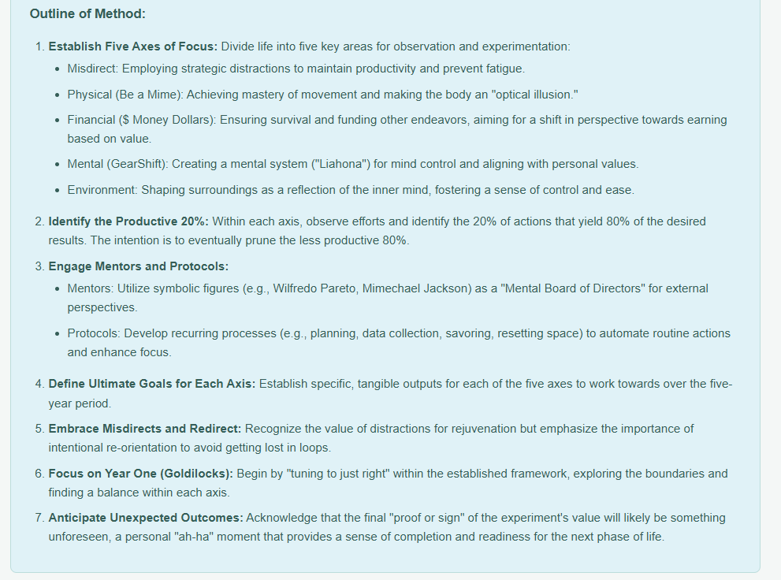

**Yearly View:** Offers an outline of the user’s current yearly goals, tracking progress against these objectives throughout the year.

**Month View:** Allows for time-based theming that doesn’t necessarily relate directly to one of the five core Axes, providing flexibility for monthly focuses or projects.
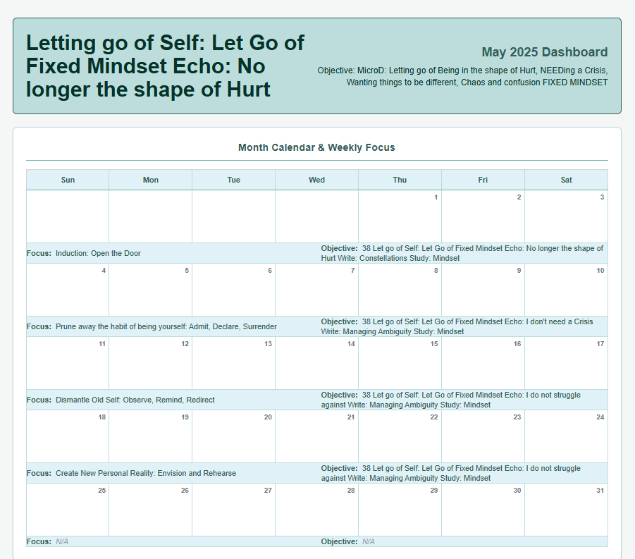
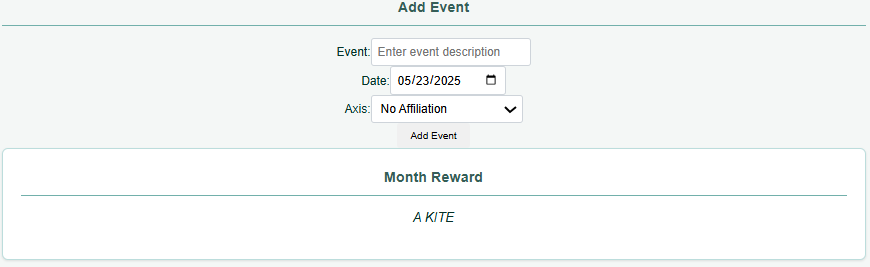

**Weekly View:** This dashboard is designed for higher-level planning and thematic organization of the week. Each day within the Weekly View is typically assigned a specific Axis or theme (e.g., Physical, Financial, Gear, Misdirect, Environment, Rest and Preparation, On Track: N+1). This helps the user align their weekly goals and steps with the broader Pareto principles and their five core axes of focus, ensuring a balanced approach to the week's activities.
    
**Daily View:** This view allows the user to manage and visualize their daily activities with more granularity helps in structuring the day to maximize productivity and intentionality, ensuring that daily actions are aligned with the weekly theme and broader goals.
Key Features:
* **Emotional/Productivity Snapshot:** The top section often features a chart or visual representation of daily productivity, epiphanies, and despairs, providing a quick understanding of the user's emotional and productive state.
    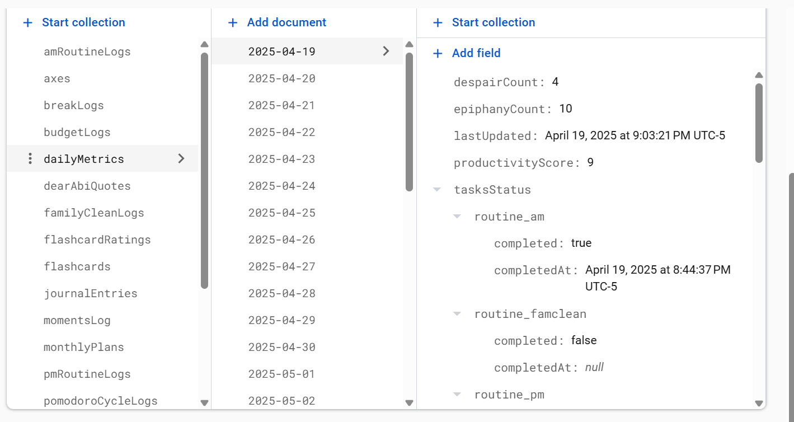
* **Dynamic Context Map:** Includes a context map that changes according to the day's assigned theme (derived from the Weekly View), offering relevant guidance, prompts, or information related to that theme.
    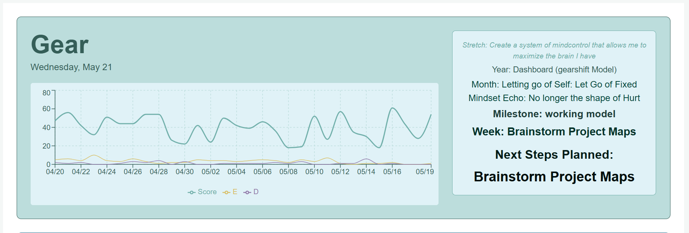
* **Dynamic Roadmap:** Displays completed, current, and upcoming milestones. Upcoming goals may be rendered with diminishing prominence the further away they are, helping to maintain focus on immediate priorities while keeping long-term objectives in sight.
    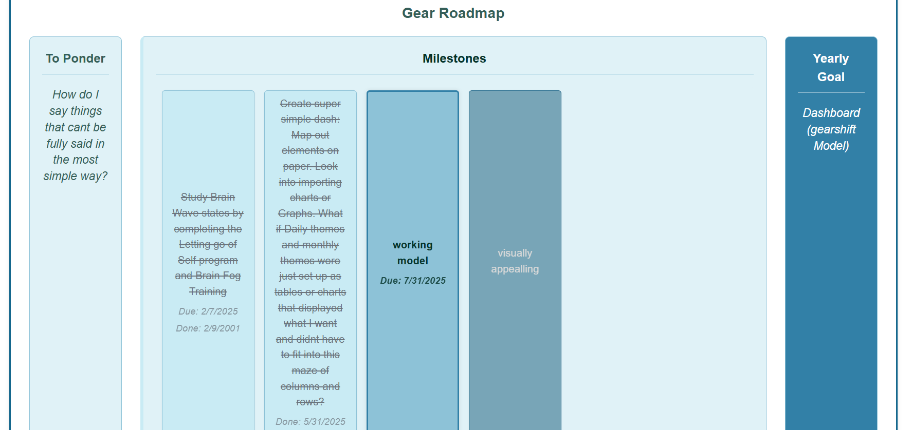
* **Data Logging Modals:** A row of buttons provides access to modals for gathering data and tracking habits, allowing the user to log specific actions, routine completions, or reflections.
* **Break Analysis:** Charts may be provided to analyze data from the Break Modal (used in the Now View), enabling the user to track and revise their process based on their break patterns and their impact on productivity.
    
    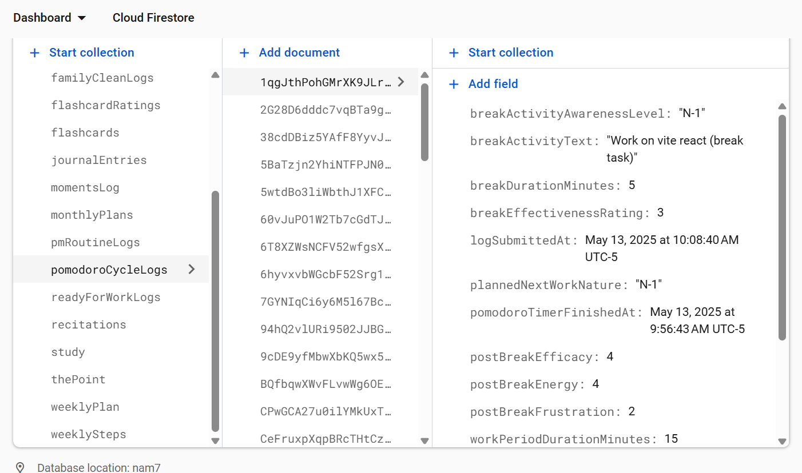
    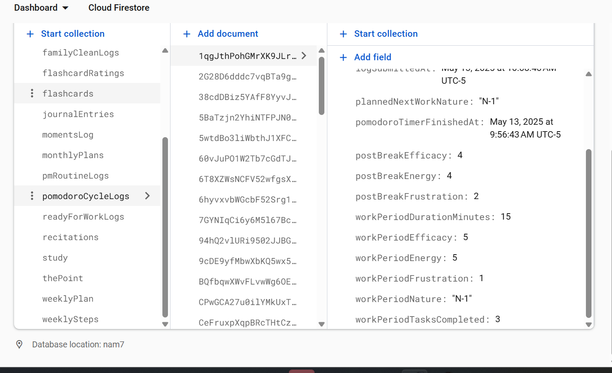

View on github: [https://github.com/tiffigail/dashboard/compare/feature/pomodoro-iteration-2-new-logic](https://github.com/tiffigail/dashboard/compare/feature/pomodoro-iteration-2-new-logic)

**Now View:** This view is designed for immediate focus, helping the user concentrate on the current task or action and ensuring that present efforts contribute directly to overarching goals. The Now View aims to minimize distractions and maximize concentration on the task at hand. The combination of real-time reflection, task management, timed focus sessions, and constant visibility of hierarchical goals ensures that the user's current "Now" focus is always aligned with their larger Pareto Project objectives.
    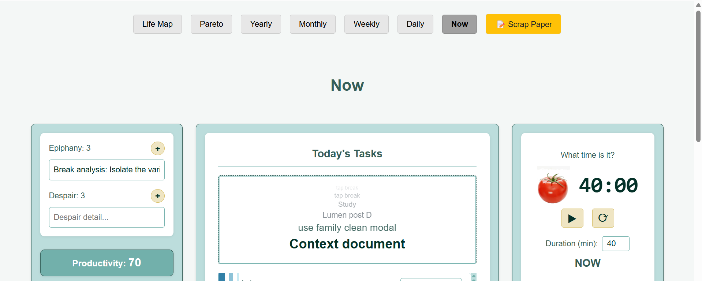

Key Features:
* **Real-time Reflection:** The top section typically includes input fields for recording Epiphanies and Despairs as they occur, along with a Productivity score for the current work session.
* **Today's Tasks Dynamic Perspective Viewer:** Lists next 6 tasks. Tasks are displayed with decreasing prominence with the current task prominently displayed.
* **Pomodoro Timer:** Features a timer (e.g., Pomodoro-style) to help manage focused work sessions, displaying the current time and controls to adjust duration for the work block. The break modal is triggered when the timer reaches zero.
    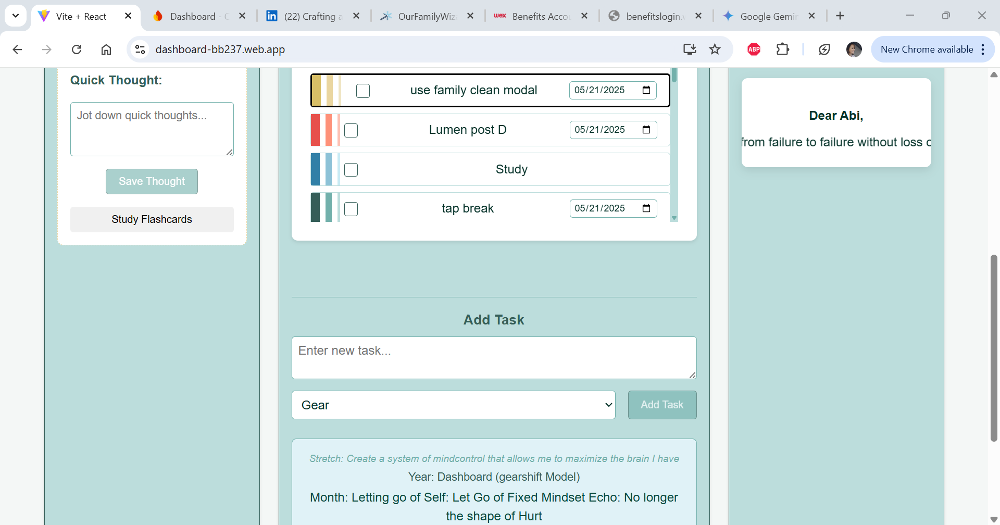
* **Task Management:** view existing tasks with checkboxes and dates, and track their progress. The user can reorder tasks or adjust the due date. Future tasks are hidden from view to avoid distraction. Each task is color coded with its assigned axis theme.
* **Quick Thoughts:** The middle section may provide a "Quick Thought" area for jotting down notes without causing disruption or requiring the user to hold thoughts in their mind during tasking
* **Flash Cards:** A pop up flash card study feature, see more in the Modals section.
* **Dear Abi Marquee:** runs selected quotes according to relevance of monthly, weekly, or daily theming.
    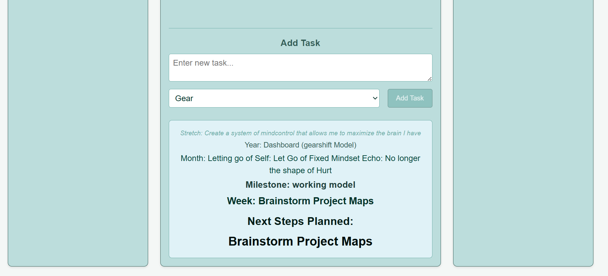
* **Quick Task Addition:** the user can select the axis and quickly view the context map when adding a task. This allows the user to align tasks with the current goal or that Axis.
* **Hierarchical Goal Context Map:** The bottom section reiterates the hierarchical contextual goals (e.g., Stretch Goal, Year Goal, Month Goal, Milestone, Week Goal, Next Steps Planned) in a clear, organized manner.

### Modals

This subsection will detail the key modals used throughout the application for data collection and interaction. It will explain their role in facilitating focused data entry, encouraging intentional reflection at crucial moments (e.g., after a Pomodoro cycle via the Break Modal, or when logging routine completion). Emphasis will be placed on how these modals help the user track progress, gather insights into their work patterns and mental state, and manage routines and habits that keep them on track.

**Key Stone or On Track Habits**

These modals help the user stay motivated and focused through time. They outline carefully designed routines built from stacked habits and are intended to act as sustaining rituals. This type of modal walks the user through reorientation, planning and provides data collection opportunities that give the user a sense of completion.

**Weekly Planning Modal**

This modal allows the user to view the upcoming milestone and plan weekly goals and upcoming next steps.

**AM Routine Modal**

The AM Modal outlines the morning checklist and allows the user to write down thoughts and keep a gratitude journal.
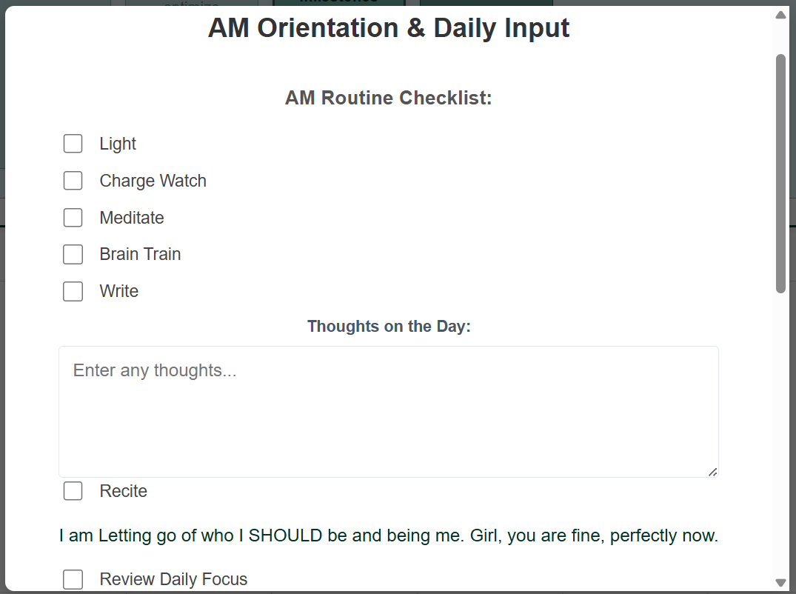
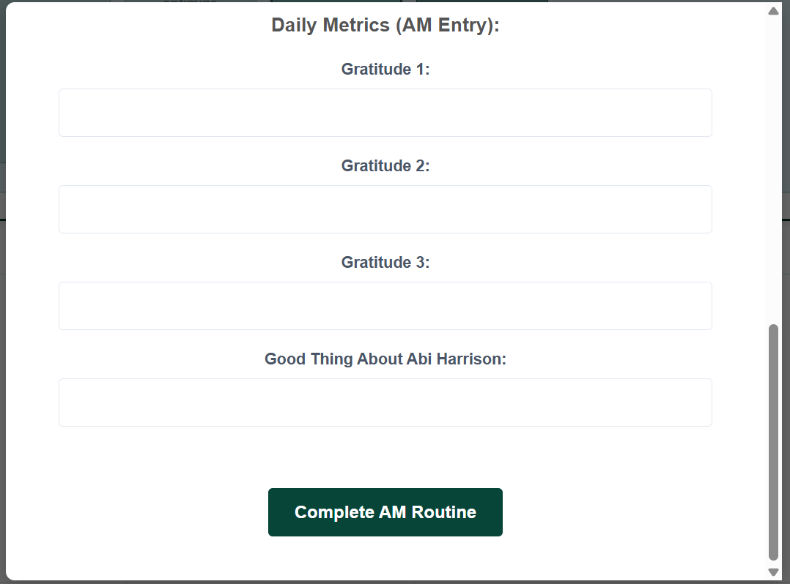

**PM Routine Modal**

The PM Routine Modal contains all of the tasks of the routine and allows the user to reflect on the day.
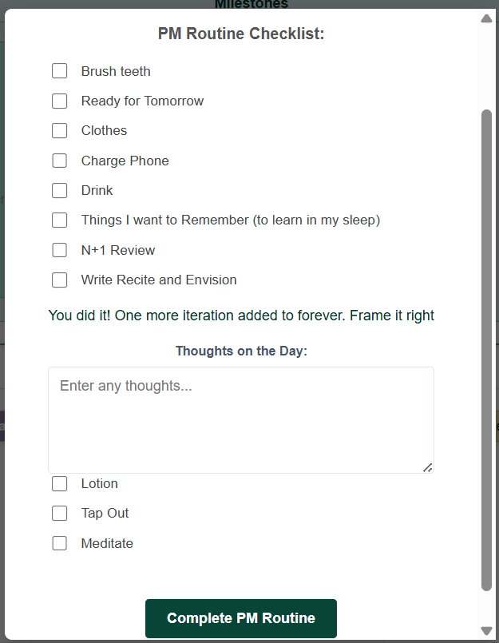

**Break Modal**

The break modal collects data on productivity, the level of focus required for the task and the mindset of the user.
*(Refer to "Break Analysis" under Daily View for related chart images like `Daily_Modals and Break Analysis Charts.png` and `Pomodorro_Cycle_Log_*.png`)*

**Tasking Modals**

These modals are training wheels for habits and collect data on the effectiveness of the recurring series of tasks.

**Family Cleaning Modal**

This modal tracks family chores and pre and post cleaning ratings.
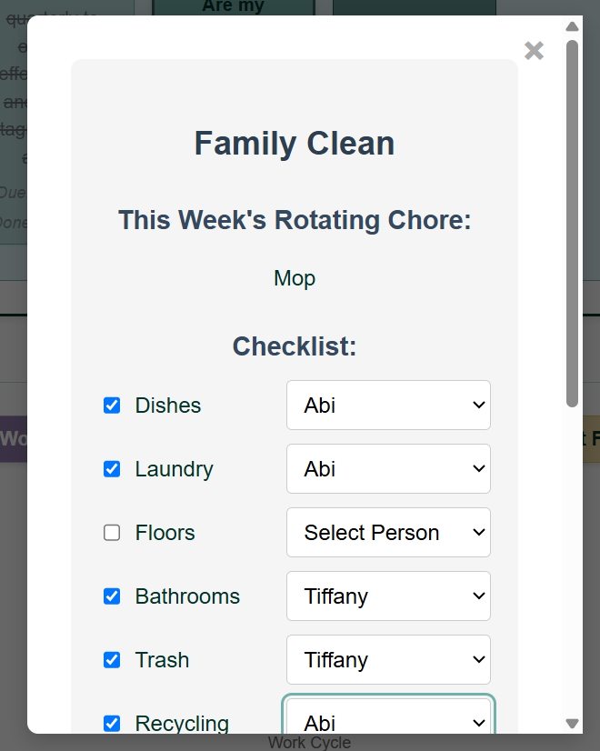
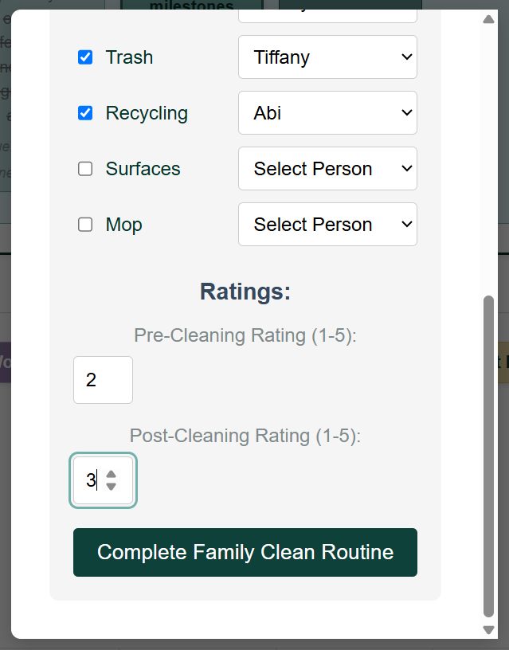

**Study Modal**

The study modal allows cross application of the current study topic and questions related to the axis. The user is also able to enter flashcards for later review.
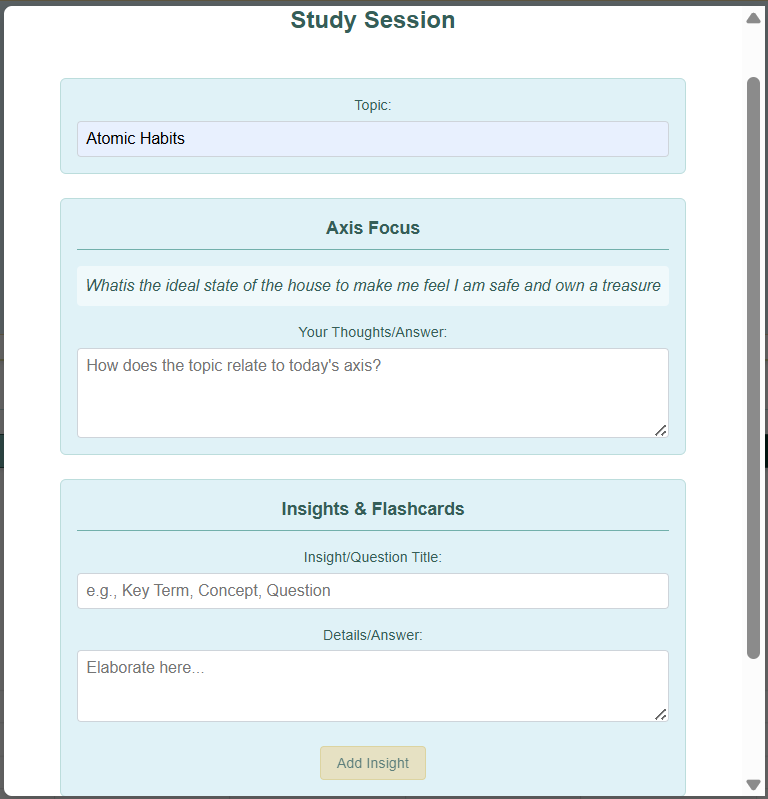
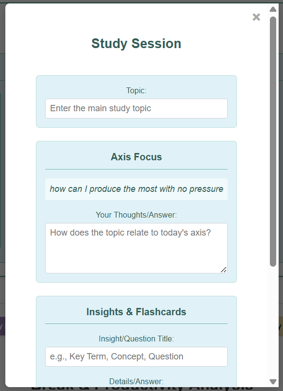
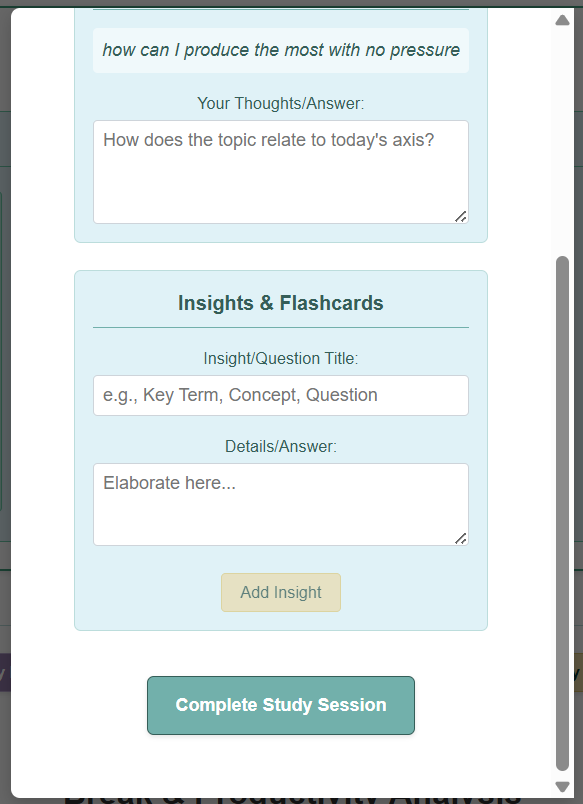

**Flash Card Modal**

The Flashcard modal allows the user to access information learned during study sessions and rate how well they know them.
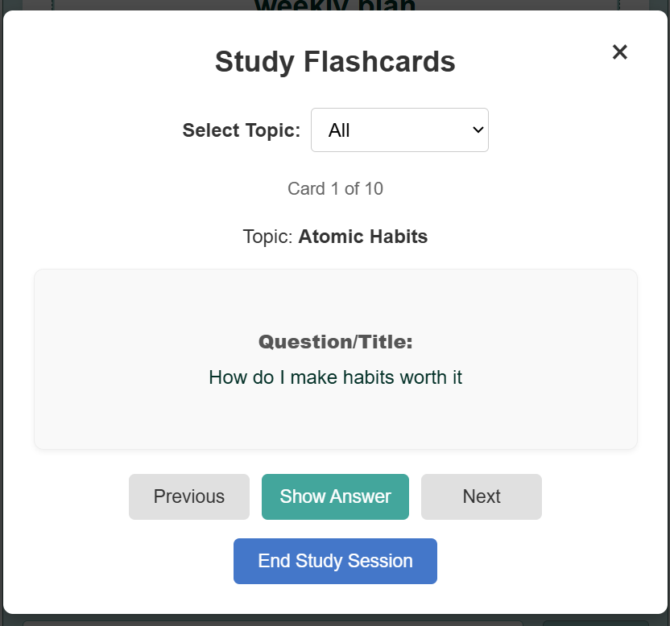
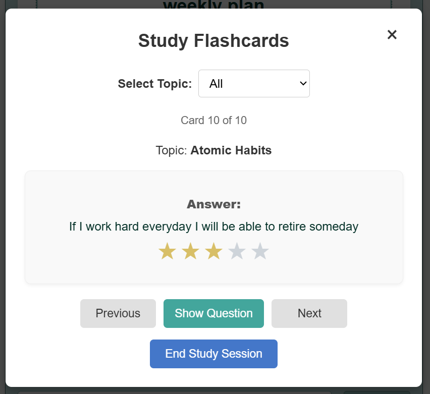
## Webapp Screenshots

Here are some screenshots of the web application:

### AM Modals

### Daily Views & Modals

### Family Clean Modals

### Flashcard Modals

### Month Views

### "Now" Section Views

### Pareto View

### PM Modal

### Pomodoro Cycle Logs

### Ready For Work Modals
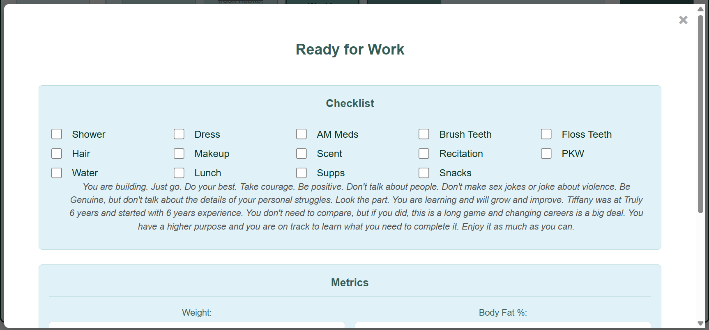
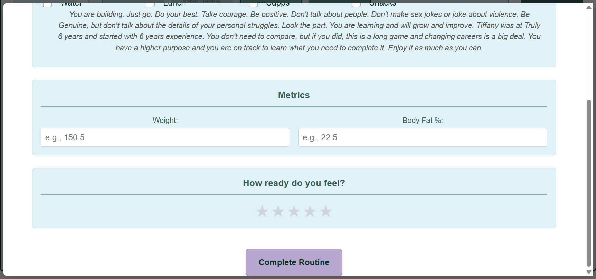

### Study Modals & Sessions

---

## Development Iterations & Feature Deep Dive

For those interested in the iterative development process and a detailed breakdown of specific features, you can explore the following:

### Pomodoro Break Analysis Feature

This feature underwent several iterations to refine its data collection, analysis, and visualization, aiming to provide actionable insights into optimizing work/break cycles.

*   **[View All Pomodoro Break Feature Iterations](../feature_iterations/pomodoro_break_feature/)**

This link will take you to the directory containing detailed logs and analyses for each development iteration of this specific feature.